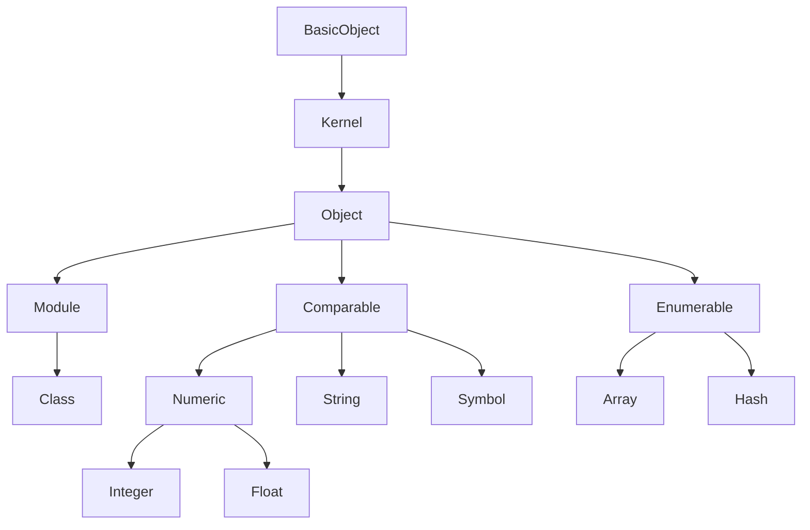

# Writing DSL


## Basic syntax of Ruby

Use the REPL to get familiar with Ruby syntax.

### Hash

Hash is equivalent to the Dictionary type in GDScript. 

There are two ways to write a Symbol as a key. 
```ruby
{ foo: true, bar: false }

{ :foo => true, :bar => false }
```
The results is the same either way.
```txt title="Output"
=> { &"foo": true, &"bar": false }
```

A Hash can use keys other than Symbols.
```ruby
{ 'foo' => true, 1 => 'bar', [:buz] => { 1.0 => 2.0 } }
```
```txt title="Output"
=> { "foo": true, 1: "bar", [&"buz"]: { 1.0: 2.0 } }
```


### Method arguments

In Ruby, keyword arguments can be passed without parentheses `()` or curly braces `{}`.
All of the following examples produce the same result.
```ruby
Alice says: 'Hello Ruby! ❤'

Alice(says: 'Hello Ruby! ❤')

Alice({ says: 'Hello Ruby! ❤' })
```
```txt title="Output"
[ Alice ] method_missing: [{ &"says": "Hello Ruby! ❤" }]
```

When defining a method that accepts an arbitary number of arguments, you can write it as follows:
* To collect arguments into an Arrayu, use a single asterisk before the parameter name (e.g. `*args`)
* To collect keyword arguments into a Hash, use two asterisks before the parameter name (e.g. `**kwargs`)
```ruby
def foo(arg, *args, **kwargs)
  Godot.emit_signal :arg, arg
  Godot.emit_signal :args, args
  Godot.emit_signal :kwargs, kwargs
end

foo 1, 2, 3, foo: true, :bar => 'buz'
```
```txt title="Output"
[ arg ] signal emitted: 1

[ args ] signal emitted: [2, 3]

[ kwargs ] signal emitted: { &"foo": true, &"bar": "buz" }
```


### Block

Blocks are distinctive feature of Ruby. You can pass a block—a special kind of argument—to a method using either curly braces `{}` or the `do ... end` syntax.

To receive a Block as a parameter, prefix the variable name with an ampersand, like `&block`.
```ruby
@block = nil
def run(&block)
  @block = block
end

run { block_called! }
# or
run do
  block_called!
end
```
```txt title="Output"
=> "#<Proc:0x1ee61f63fc0 -:->"
```
In Ruby, a Block passed to a method becomes a procedural object known as an instance of the Proc class.

Blocks are commonly used in DSLs because they offer the following characteristics:
* They are not evaluated at the time of method invocation
* They can be stored in variables
* Unlike other languages that require explicit constructs like `function` to define behavior, Ruby allows concise and implicit block syntax.

To execute a Proc object, use the following pattern:
```ruby
@block.call
# or
@block.()
# or
instance_exec(&@block)
```
```txt title="Output"
[ block_called! ] method_missing: []
```

`instance_exec` evaluates a Proc object in the context of the instance on which the method is called—known as the receiver.

```ruby
class Foo
  def block_called!
    1
  end
end

foo = Foo.new
foo.instance_exec(&@block)
```
```txt title="Output"
=> 1
```

### self

In Ruby, when the receiver of a method call is omitted, `self` is used implicitly.
It's important to always be aware of what `self` refers to in a given context.

```ruby
class Foo
  def self.whoami
    self
  end
  
  def whoami
    self
  end
end

[self, Foo.whoami, Foo.new.whoami]
```
```txt title="Output"
=> [main, Foo, #<Foo:0x1ee25c4fda0>]
```

### method_missing

All values in Ruby are objects, and every object is an instance of a class. Even `true`, `false`, and `nil` belong to specific classes.
```ruby
self.class              # => Object
self.class.ancestors    # => [Object, Kernel, BasicObject]

Foo.class               # => Class
Foo.class.ancestors     # => [Class, Module, Object, Kernel, BasicObject]

Foo.new.class           # => Foo
Foo.new.class.ancestors # => [Foo, Object, Kernel, BasicObject]

true.class              # => TrueClass
true.class.ancestors    # => [TrueClass, Object, Kernel, BasicObject]

false.class             # => FalseClass
false.class.ancestors   # => [FalseClass, Object, Kernel, BasicObject]

nil.class               # => NilClass
nil.class.ancestors     # => [NilClass, Object, Kernel, BasicObject]
```

The diagram below shows the parent-child relationships among major Ruby classes. All objects ultimately inherit from `BasicObject`.



You can use `methods` to retrieve all public and protected methods available to an object.
```ruby
1.methods # => [truncate, tap, hash, !, %, upto, ===, <=>, &, +, to_r, ...]
```
When a method is called on an object and is not defined in its class,
Ruby searches up the cals hierarchy to find a metching method.

In the method is not found even after reaching `BasicObject`, Ruby normally raises a `NoMethodError`.
However, in ReDScribe, this exception is intercepted by defining a custom `method_missing` method. Instead of raising an error, it emits a `method_missing` signal.

While `method_missing` can be risky, it provides powerful metaprogramming capablities.

For example, it can be used like this:
```ruby
module IntegerExt
  def to_kanji
    chars = %w(〇 一 二 三 四 五 六 七 八 九)
    to_s.split('').map{|i| chars[i.to_i] }.join
  end

  def method_missing(name, *args)
    "#{to_kanji}#{name}#{args.map(&:to_s).join}"
  end
end
Integer.prepend IntegerExt
```
```ruby
2025.年 7.月 19.日

5.兆 300.億円
```
```txt title="Output"
=> "二〇二五年七月一九日"

=> "五兆三〇〇億円"
```
`method_missing` is especially useful when it's difficult or inefficient to predefine many individual methods.


### Object#extend and Module#include

To add methods to an `Object`, use `extend`.
To add instance methods to a `Module` or `Class`, use `include`.

```ruby
module Hello
  def hello!
    self.to_s + ' hello!'
  end
end

module Yeah
  def yeah!
    self.to_s + ' yeah!'
  end
end

class Bar
  extend Hello
  include Yeah
end
```

```ruby
Bar.hello!
Bar.yeah!
```
  
```txt title="Output"
=> "Bar hello!"

[ yeah! ] method_missing: []
=> <null>
```
```ruby
Bar.new.hello!
Bar.new.yeah!
```
  
```txt title="Output"
[ hello! ] method_missing: []
=> <null>

=> "#<Bar:0x1ee25c4c650> yeah!"
```

### Module#prepend

To override methods in Ruby's built-in classes, use `prepend`.

Unlike `include`, `prepend` adds the module to the beginning of the inheritance chain, allowing methods to be overridden.

```ruby
''.to_i # => 0
1.to_s  # => '1'
```

```ruby
module Helper
  def to_s
    super + '!'
  end

  def to_i
    super + 100
  end
end

String.include Helper
Integer.prepend Helper
```
```ruby
''.class.ancestors # => [String, Helper, Comperable, ...]
1.class.ancestors  # => [Helper, Integer, Numeric, ...]
```
```ruby
''.to_i

1.to_s
```
```txt title="Output"
=> 0

=> '1!'
```

### Operator Overloading

Ruby also supports operator overloading.
```ruby
:first > :second           # => false
:first > :second > :third  # method_missing

- :Ruby                    # method_missing
```
```ruby
class SymbolChain
  attr_accessor :chain

  def initialize(origin)
    self.chain = [origin]
  end

  def add(sym)
    tap { self.chain << sym }
  end
  alias_method :>, :add
end

module SymbolExt
  def >(other)
    SymbolChain.new(self).add(other)
  end

  def -@
    "I love #{self}"
  end
end

Symbol.prepend SymbolExt
```

```ruby
:first > :second > :third

- :Ruby
```
  
```txt title="Output"
=> "#<SymbolChain:0x1ab31c765a0 @chain=[:first, :second, :third]>"

=> "I love Ruby"
```


## Basic DSL Example

```ruby
class Player
  attr_accessor :name

  def initialize(name)
    self.name = name
  end

  def walk
    emit :walk
  end

  def jump
    emit :jump
  end

  private
    def emit(key)
      Godot.emit_signal key, { name: name }
    end
end


def player(name, &block)
  Player.new(name).instance_exec(&block)
end
```

```ruby
player 'Alice' do
  3.times { walk }
  jump
end
```

```txt title="Output"
[ walk ] signal emitted: { &"name": "Alice" }
[ walk ] signal emitted: { &"name": "Alice" }
[ walk ] signal emitted: { &"name": "Alice" }
[ jump ] signal emitted: { &"name": "Alice" }
```
