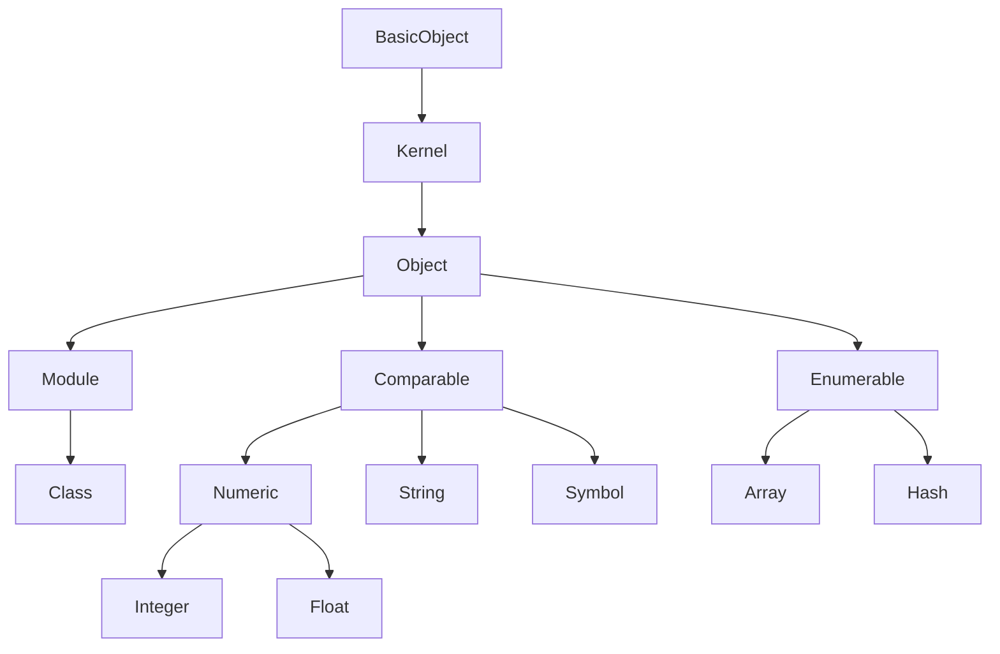

# DSL を書く

## Ruby の基本的な文法を確認する

REPL を使って、Ruby の文法を把握しましょう。


### Hash

Hash は、GDScript では Dictionary 型に相当します。
Symbol をキーにする場合の書き方は2通りあります。
```ruby
{ foo: true, bar: false }

{ :foo => true, :bar => false }
```
どちらも結果は同じです。
```txt title="Output"
=> { &"foo": true, &"bar": false }
```

Symbol 以外もキーにできます。
```ruby
{ 'foo' => true, 1 => 'bar', [:buz] => { 1.0 => 2.0 } }
```
```txt title="Output"
=> { "foo": true, 1: "bar", [&"buz"]: { 1.0: 2.0 } }
```


### 引数

Ruby では、メソッドに渡すキーワード引数には、`()` だけではなく `{}` も省略して渡せます。
以下はすべて同じ結果になります。
```ruby
Alice says: 'Hello Ruby! ❤'

Alice(says: 'Hello Ruby! ❤')

Alice({ says: 'Hello Ruby! ❤' })
```
```txt title="Output"
[ Alice ] method_missing: [{ &"says": "Hello Ruby! ❤" }]
```

メソッドを定義して、任意の数を引数を受け取りたい場合は以下のように書きます。 
* Array クラスとして展開する場合は `*args` のようにアスタリスクを引数名の前に1つ
* Hash クラスとして展開する場合は `**kwargs` のようにアスタリスクを引数名の前に2つ
```ruby
def foo(arg, *args, **kwargs)
  Godot.emit_signal :arg, arg
  Godot.emit_signal :args, args
  Godot.emit_signal :kwargs, kwargs
end

foo 1, 2, 3, foo: true, :bar => 'buz'
```
```txt title="Output"
[ arg ] signal emitted: 1

[ args ] signal emitted: [2, 3]

[ kwargs ] signal emitted: { &"foo": true, &"bar": "buz" }
```


### ブロック

ブロックは Ruby の特徴的な機能です。`{}` もしくは `do ... end` でブロックと呼ばれる特殊な引数をメソッドに渡すことが可能です。

ブロックを引数として受け取る際は、`&block` のようにアンパサンドを引数名の前に書きます。
```ruby
@block = nil
def run(&block)
  @block = block
end

run { block_called! }
# or
run do
  block_called!
end
```
```txt title="Output"
=> "#<Proc:0x1ee61f63fc0 -:->"
```
ブロックで渡された引数は Proc クラスと呼ばれる手続き型になります。

ブロックは以下の特徴を持つため、DSL でよく利用されます。
* メソッド呼び出し時には評価されない
* 変数に格納することができる
* 他言語で同等の機能を使う場合に `function` などプログラミング言語特有の名前を使わないといけないが、Ruby だと書かなくてよい

Proc クラスを評価するには以下のようにします。
```ruby
@block.call
# or
instance_exec(&@block)
```
```txt title="Output"
[ block_called! ] method_missing: []
```

`instance_exec` は、Proc クラスの手続きを、そのメソッドが呼ばれたインスタンス(レシーバという)で評価します。

```ruby
class Foo
  def block_called!
    1
  end
end

foo = Foo.new
foo.instance_exec(&@block)
```
```txt title="Output"
=> 1
```

### self

Ruby はメソッド呼び出し時のレシーバを省略した場合は、`self` が暗黙のレシーバになります。常に `self` が何を指しているか意識することが重要になります。

```ruby
class Foo
  def self.whoami
    self
  end
  
  def whoami
    self
  end
end

[self, Foo.whoami, Foo.new.whoami]
```
```txt title="Output"
=> [main, Foo, #<Foo:0x1ee25c4fda0>]
```

### method_missing

Ruby のオブジェクトは必ず何かしらのクラスに属しています。`true` や `false`, `nil` であっても例外ではありません。
```ruby
self.class              # => Object
self.class.ancestors    # => [Object, Kernel, BasicObject]

Foo.class               # => Class
Foo.class.ancestors     # => [Class, Module, Object, Kernel, BasicObject]

Foo.new.class           # => Foo
Foo.new.class.ancestors # => [Foo, Object, Kernel, BasicObject]

true.class              # => TrueClass
true.class.ancestors    # => [TrueClass, Object, Kernel, BasicObject]

false.class             # => FalseClass
false.class.ancestors   # => [FalseClass, Object, Kernel, BasicObject]

nil.class               # => NilClass
nil.class.ancestors     # => [NilClass, Object, Kernel, BasicObject]
```

主なクラスの親子関係の樹形図を以下に示します。すべてのオブジェクトは元を辿れば `BasicObject` を親に持ちます。


あるオブジェクトが呼び出せるすべての public および protected メソッドは `methods` で取得できます。
```ruby
1.methods # => [truncate, tap, hash, !, %, upto, ===, <=>, &, +, to_r, ...]
```
メソッド呼び出し時に自身のクラスにメソッドが定義されていない場合、Ruby はそのオブジェクトのクラス階層を順に探索します。

`BasicObject` まで探索して存在しないメソッドだった場合、本来 `NoMethodError` という例外が発生しますが、ReDScribe では `method_missing` メソッドを定義して例外をフックしているため例外は発生しません。代わりに **method_missing** シグナルを発行するようにしています。

この `method_missing` は、危険ですがとても強力なメタプログラミングの力を与えます。

例えば、以下のように利用することができます。
```ruby
module IntegerExt
  def to_kanji
    chars = %w(〇 一 二 三 四 五 六 七 八 九)
    to_s.split('').map{|i| chars[i.to_i] }.join
  end

  def method_missing(name, *args)
    "#{to_kanji}#{name}#{args.map(&:to_s).join}"
  end
end
Integer.prepend IntegerExt
```
```ruby
2025.年 7.月 19.日

5.兆 300.億円
```
```txt title="Output"
=> "二〇二五年七月一九日"

=> "五兆三〇〇億円"
```
`method_missing` を使うメリットがあるのは、多くのメソッドを予め定義するのが難しい場合などです。


### Object#extend と Module#include

`Object` にメソッドを追加する場合は `extend` を使います。
`Module` および `Class` にインスタンスメソッドを追加する場合は `include` を使います。

```ruby
module Hello
  def hello!
    self.to_s + ' hello!'
  end
end

module Yeah
  def yeah!
    self.to_s + ' yeah!'
  end
end

class Bar
  extend Hello
  include Yeah
end
```

```ruby
Bar.hello!
Bar.yeah!
```
  
```txt title="Output"
# => "Bar hello!"

# [ yeah! ] method_missing: []
# => <null>
```
```ruby
Bar.new.hello!
Bar.new.yeah!
```
  
```txt title="Output"
# [ hello! ] method_missing: []
# => <null>

# => "#<Bar:0x1ee25c4c650> yeah!"
```

## DSL の基本例

```ruby
class Player
  attr_accessor :name

  def initialize(name)
    self.name = name
  end

  def walk
    emit :walk
  end

  def jump
    emit :jump
  end

  private
    def emit(key)
      Godot.emit_signal key, { name: name }
    end
end

def player(name, &block)
  Player.new(name).instance_exec(&block)
end
```

```ruby
player 'Alice' do
  3.times { walk }
  jump
end
```

```txt title="Output"
[ walk ] signal emitted: { &"name": "Alice" }
[ walk ] signal emitted: { &"name": "Alice" }
[ walk ] signal emitted: { &"name": "Alice" }
[ jump ] signal emitted: { &"name": "Alice" }
```
